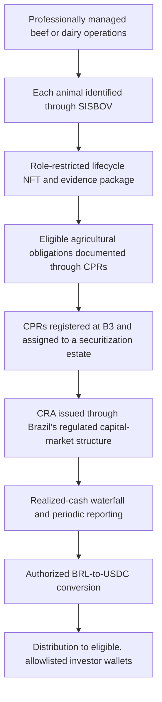

# Livestock Rent

**A Brazil-first livestock RWA platform connecting professionally managed
cattle operations, regulated agribusiness finance, animal-level traceability,
and Web3 settlement.**

> **Project status:** research and structuring stage. Livestock Rent is not
> currently offering securities, tokens, or guaranteed returns.

## The opportunity

Brazil has one of the world's largest cattle economies, established agricultural
credit instruments, and growing individual-animal traceability. Livestock Rent
aims to combine that infrastructure with a software-enabled asset-management and
servicing platform for beef and dairy operations.

The project is designed to give eligible investors hands-off exposure to
livestock cash flows while providing:

- professional farm and animal underwriting;
- individual cattle identity and lifecycle evidence;
- reconciliation between physical assets, legal records, and financial claims;
- regulated Brazilian capital-markets infrastructure; and
- permissioned Web3 administration with USDC as a proposed settlement rail.

The investable thesis is the operating, compliance, traceability, and servicing
platform—not simply a “token backed by cows.”

## Proposed structure

The intended four-month distribution cycle is based only on collected,
distributable cash after operating costs, taxes, reserves, fees, and other
waterfall obligations. It is a target operating cadence, not a guaranteed
payment schedule.

## Brazilian infrastructure

International readers may not be familiar with the core Brazilian terms:

| Term | Role in the proposed structure |
|---|---|
| **B3** | Brazil's principal financial-market infrastructure and exchange, where relevant CPR and CRA records may be registered or deposited |
| **CPR — Cédula de Produto Rural** | Agricultural credit instrument used to document eligible rural product or financial obligations |
| **CRA — Certificado de Recebíveis do Agronegócio** | Agribusiness-receivables security issued through a securitization structure |
| **SISBOV** | Brazil's official system for individual identification and traceability of bovine and buffalo animals |
| **GTA — Guia de Trânsito Animal** | Official document supporting animal-movement controls |
| **CVM** | Brazil's securities regulator |
| **BCB/BACEN** | The Central Bank of Brazil, relevant to payments, foreign exchange, and virtual-asset service providers |

B3 registration strengthens formal financial traceability, but it does not
independently guarantee payment, animal existence, title, collateral
perfection, or absence of fraud.

## SISBOV-connected animal NFTs

Each admitted animal is intended to have one non-financial lifecycle NFT
connected one-to-one to its official SISBOV identity.

The NFT acts as a tamper-evident index for evidence such as:

- physical tag and SISBOV status;
- purchase invoice and farm entry;
- GTA and sanitary records;
- veterinary and health events;
- location and custody changes;
- recurring independent physical attestations; and
- sale, slaughter, death, loss, or retirement.

Sensitive documents remain off-chain with controlled access; only necessary
references and cryptographic evidence should be placed on-chain.

The animal NFT is not an investment token. It does not grant ownership,
dividends, redemption, or public trading rights, and it cannot independently
prove that the physical animal currently exists.

## Two separate financial strategies

### Beef finishing

A closed-vintage strategy with a defined acquisition window, professionally
selected farms, individually identified animals, and contracted or
underwritten exit channels. Cash is realized primarily when cattle are sold.

### Dairy productive herds

A longer-duration strategy based on recurring milk production, animal health,
quality metrics, and residual cattle value. Dairy requires separate
underwriting because feed, labor, fertility, lactation, milk pricing, and
offtaker performance materially affect returns.

Beef and dairy will not be combined into a single initial pool because their
cash cycles, risks, and operating metrics differ.

## Why Web3

Blockchain is used as an auditability and administration layer:

- tamper-evident animal lifecycle records;
- reconciliation between assets and financial claims;
- permissioned investor eligibility and transfer controls;
- transparent reporting and distribution calculations; and
- programmable settlement using native, issuer-supported USDC.

Legal ownership, investor rights, custody, and payment obligations remain
controlled by enforceable contracts, B3 records, securitization documents, and
applicable law—not by blockchain metadata alone.

## Development path

1. **Legal and operating proof**
   - Validate livestock contracts, CPR/CRA eligibility, securities treatment,
     tax structure, SISBOV integration, payment rails, and asset controls.

2. **Sponsor-funded pilot**
   - Operate a small beef-finishing cohort.
   - Reconcile every animal and cash event.
   - Test NFT lifecycle, verifier, dispute, and exception procedures.

3. **Regulated private pool**
   - Launch only after the pilot establishes enforceability, operational
     performance, controls, and independently reviewable records.

4. **Platform expansion**
   - Add dairy and other livestock strategies as separate products.
   - Expand to additional regions and, later, evaluate a separately compliant
     United States distribution structure.

## Current repository

- [`AGENTS.md`](AGENTS.md) — project-wide operating rules for AI agents and
  collaborators.
- [`research/livestock-rwa-vc-analysis-2026-07-16.md`](research/livestock-rwa-vc-analysis-2026-07-16.md)
  — business, regulatory, operational, and investment analysis.

## Intended stakeholders

- Web3 venture capital and angel investors;
- agribusiness operators and livestock specialists;
- securitization companies and regulated distribution partners;
- veterinarians, SISBOV certifiers, auditors, and assurance providers;
- payment, custody, stablecoin, and blockchain infrastructure providers; and
- legal, tax, accounting, and regulatory professionals.

## Important notice

This repository contains strategic research and a proposed business
architecture. It is not legal, tax, accounting, veterinary, regulatory, or
investment advice, and it is not an offer or solicitation.

Any launch requires qualified Brazilian professional advice, regulated
partners, verified farm-level data, independent controls, and the applicable
authorizations. A future US offering or distribution path requires a separate
US legal and regulatory analysis.

## Project lead

[Jeff Prestes](https://github.com/jeffprestes)
